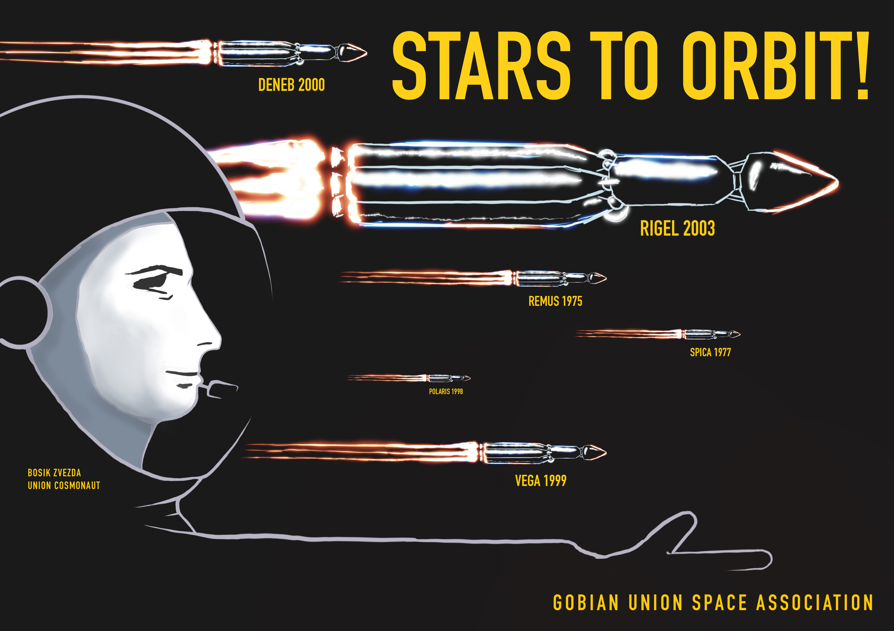

# Story

***Just for fun, no project-relevant content on this page.***

```
The world dreams once again. The buildup of propulsion, material and
computing technology reaches a critical point and rekindles the fervor
of space exploration! The world looks up to the sky and dares to explore
the unknown, extend our reaches and expand our understanding.

You are part of the ambitious Jupiter exploration program at the
Caltopia Space Agency. However, the project is plagued with problems
before it even begins. The reckless orbital launches by various space
programs over decades has filled lower earth orbit with space debris,
preventing the massive Jupiter-bound ships from passing through. CSA
must first pave the way to space by deorbiting old unused satellites.

The CSA can easily deorbit their own old satellites, but the same cannot
be said for satellites launched by the former Gobian Union. The CSA does
not have the credentials to assume control, and the agency responsible
for these satellites no longer exists. Luckily for you, these old
satellites employ the old, insecure technology of a bygone era. Your job
is to hack into the decommissioned satellites and remove them from
orbit.

The agency has faith that you can help forge a new path to Jupiter and
beyond.
```


